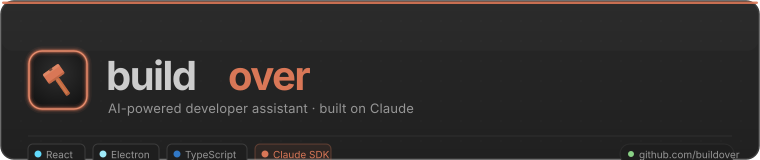
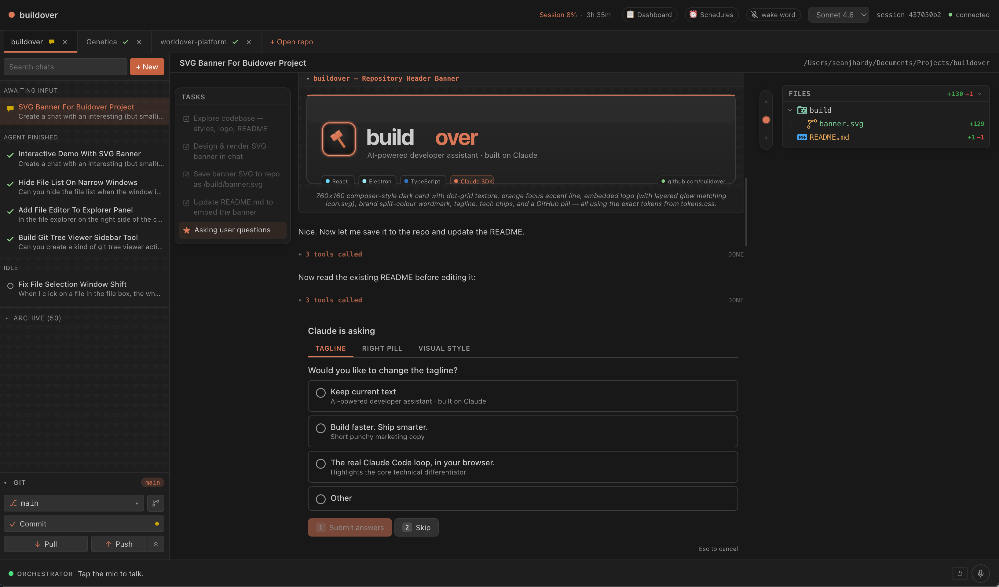

A local browser chat that runs the **real Claude Code agent loop** under the hood — same harness as the VS Code extension. Built with Vite + React on the frontend and `@anthropic-ai/claude-agent-sdk` on a small Node server.

```
Browser (Vite + React)  ←─ WebSocket ─→  Local Node server  ──→  Claude Code agent loop
                                                                  (via @anthropic-ai/claude-agent-sdk)
```



## v1 features

- Multi-turn chat with session resumption.
- Streaming display: text, thinking blocks, tool calls, tool results.
- Model selector (Opus 4.7 / Sonnet 4.6 / Haiku 4.5).
- Same design tokens as the VS Code extension webview (Claude orange accent, dark theme).
- Tool results are spliced back into the assistant message that issued the call, so each tool card shows its own input + output collapsed by default.

Not yet (planned next): file attachments, plan-mode multi-select prompts, MCP server browser, diff viewer for Edit/Write tool calls, permission prompts UI.

## Setup

1. **Auth.** The SDK delegates to your local `claude` CLI binary, so make sure `claude` runs in your terminal first. Alternatively, set `ANTHROPIC_API_KEY`.
2. **Install:**
   ```bash
   npm install
   ```
3. **Run:**
   ```bash
   npm run dev
   ```
   This starts the WS server on `:8787` and the Vite dev server on `:5173`. Open <http://localhost:5173>.

## Building as a standalone Mac app

```bash
npm run build
```

This installs **buildover** as a native macOS app at `/Applications/buildover.app` and launches it. Under the hood it:

1. Compiles the Electron TypeScript entry point.
2. Creates a real `.app` bundle that delegates to the Electron binary already in `node_modules` (no separate Electron install required, and no Gatekeeper complaints about copied binaries).
3. Wires the bundle's `main.js` directly to `dist-electron/main.cjs` **inside this repo**, so the app is *live* — any code changes you compile are picked up on the next launch without re-running the script.
4. Registers the bundle with macOS Launch Services and opens it.

After running once you can launch buildover from Spotlight, Finder, or pin it to your Dock like any other app. Re-run `npm run build` whenever you want to refresh the installation (e.g. after pulling a new version).

> **Note:** this is different from `npm run electron:build`, which packages a fully self-contained distributable DMG/zip via electron-builder.

## Working directory

The agent runs in the directory you started the server from (`process.cwd()`). For now, `cd` to the repo you want Claude to work on before `npm run dev`. A directory picker is on the v2 list.

## Voice input (Whisper via Groq)

The composer has a mic button that streams audio to Groq's Whisper endpoint and inserts the transcript into the input as you speak.

- Put your Groq key in `.env` at the repo root: `WHISPER_API_KEY="..."`. The dev server loads it automatically (Node's `--env-file-if-exists`). The key never leaves the server.
- Optional: `GROQ_WHISPER_MODEL` (default `whisper-large-v3-turbo`).
- Click the mic to start, click again to stop. Partial transcripts replace as new chunks are sent (~every 4s); a final pass runs on stop.
